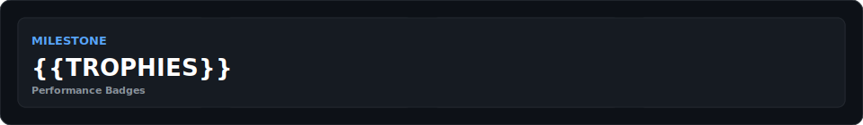

# **Hey 👋, I'm Sahad Sha**

## **Dev-Sahad**

> **Junior Developer · Bot Architect · AI Engineer**  
> *Building automation tools that power real communities — 24/7*

---

<table>
  <tr>
    <td width="34%" align="center">
      
    </td>
</table>

> The analyzer performs image-format and pixel-channel measurements only. It does not use facial recognition or infer identity, health, emotion, personality, or other biometric traits.

---

  

---

## 🧭 Quick Navigation

[Snapshot](#-developer-snapshot) · [Pixel Profile](#-pixel-profile-analysis) · [Workflows](#-automated-workflows) · [Docs](#-repository-documentation) · [Projects](#-featured-projects) · [Tech Stack](#️-tech-stack) · [Contact](#-connect-with-me) · [Metrics](#-live-developer-metrics)

## 👨‍💻 Developer Snapshot

| | |
|---|---|
| **Current focus** | Reliable automation, AI-assisted tools, and community platforms |
| **What I build** | Discord and Telegram bots, web applications, developer tooling, and integrations |
| **How I work** | Plan → build → validate → automate → improve |
| **Collaboration** | Open-source contributions, freelance projects, remote work, and mentorship |

<strong>Explore how I turn ideas into dependable software</strong>

- **Automation first:** remove repetitive work with scheduled jobs, bots, and integrations.
- **Reliability built in:** validate code, links, assets, and generated content before release.
- **Community centered:** design tools that are practical for real users and active communities.
- **Continuous learning:** document decisions, measure outcomes, and refine each release.

---

## 🚀 Automated Workflows

### **GitHub Actions Integration**

  
  
  
  
  

---

## 📊 GitHub Stats & Analytics

  
  

<!--START_LANGUAGES-->
## 🧠 Top Languages

_Updated daily from GitHub activity_
<!--END_LANGUAGES-->

  
  

  
  
  
  

  
  

---

## 🎯 Contribution Summary

| 📈 Source | 📊 Live View |
|-----------|--------------|
| **Public repositories** | [Browse on GitHub](https://github.com/Dev-Sahad?tab=repositories) |
| **Contribution activity** | [View contribution graph](https://github.com/Dev-Sahad) |
| **Developer metrics** | [Generated metrics](#-live-developer-metrics) |
| **Featured work** | [Project showcase](SHOWCASE.md) |

All contribution figures on this page come from live GitHub data or generated repository assets.

---

## 📑 My Profile Pages

  <table>
    <tr>
      <th>📄 Page</th>
      <th>📝 Description</th>
      <th>🔗 Link</th>
      <th>⚙️ Maintenance</th>
    </tr>
    <tr>
      <td><strong>CV & Resume</strong></td>
      <td>Professional background, skills, and experience timeline</td>
      <td>
        
      </td>
      <td></td>
    </tr>
    <tr>
      <td><strong>Showcase</strong></td>
      <td>Project demos, achievements, and live portfolio link</td>
      <td>
        
      </td>
      <td></td>
    </tr>
    <tr>
      <td><strong>Journey</strong></td>
      <td>Learning path, milestones, and personal development story</td>
      <td>
        
      </td>
      <td></td>
    </tr>
    <tr>
      <td><strong>Contribution Guide</strong></td>
      <td>How to propose improvements to this profile repository</td>
      <td>
        
      </td>
      <td></td>
    </tr>
  </table>

---

## 📚 Repository Documentation

| Guide | What it covers |
|---|---|
| [Documentation index](docs/README.md) | Entry point for repository guides |
| [Architecture](docs/ARCHITECTURE.md) | Structure, data flow, boundaries, and design principles |
| [Automation](docs/AUTOMATION.md) | Workflow triggers, permissions, outputs, and recovery |
| [Maintenance](docs/MAINTENANCE.md) | Validation, regeneration, and routine review procedures |
| [Asset catalog](Assets/README.md) | Source and generated asset ownership |
| [Script reference](scripts/README.md) | Commands, interfaces, and generator contracts |
| [Maintainer guide](MAINTAINERS.md) | Ownership map, merge checklist, and branch policy |

---

## 🚀 Featured Projects

  <table>
    <tr>
      <th>🎯 Project</th>
      <th>💻 Type</th>
      <th>✅ Status</th>
      <th>📊 Stats</th>
      <th>🔗 Repository</th>
    </tr>
    <tr>
      <td><strong>MINNAL BOT</strong></td>
      <td>
        
      </td>
      <td></td>
      <td>Private</td>
      <td>
        
      </td>
    </tr>
    <tr>
      <td><strong>PORTFOLIO-V1</strong></td>
      <td>
        
      </td>
      <td></td>
      <td></td>
      <td>
        
      </td>
    </tr>
    <tr>
      <td><strong>GODZILLA BOT</strong></td>
      <td>
        
      </td>
      <td></td>
      <td>Private</td>
      <td>
        
      </td>
    </tr>
    <tr>
      <td><strong>Noiz</strong></td>
      <td>
        
      </td>
      <td></td>
      <td>Private</td>
      <td>
        
      </td>
    </tr>
  </table>

---

## 🛠️ Tech Stack

### **Frontend**

  
  
  
  
  
  
  

### **Backend & Runtime**

  
  
  
  

### **Database & Storage**

  
  
  
  

### **Tools & DevOps**

  
  
  
  
  

---

## 🏆 Key Achievements

  
  
  
  
  
  

---

## 📚 Currently Learning

  
  
  
  
  

---

## 📬 Connect With Me

  
  
  
  
  
  
  
  
  
  
  

---

## 🤝 Open to Opportunities

  
  
  
  

---
## 😉 Random Jokes

  
Click to see a random joke

  

  

  

---

## 🎵 Now Playing

  

---

## 🎮 Discord Presence

  

---

## 💖 Support My Work

  
  
  

---

## 📊 Repository Stats

  
  
  
  
  

---

## ⚙️ Workflow Automation

  
  ### **GitHub Actions Workflows**
  
  All workflows configured in `.github/workflows/`
  
  - **Profile Validation**: Checks scripts, internal links, and generated SVG assets
  - **Pixel Profile Analysis**: Verifies `PP.png` and its generated technical report
  - **Developer Metrics**: Refreshes the metrics card daily
  - **Language & Trophy Cards**: Refresh generated profile cards on a schedule
  - **Terminal Card**: Verifies deterministic terminal output when its source changes
  - **Contribution Snake**: Refreshes the contribution animation every 12 hours
  - **Profile Date**: Refreshes the README date weekly

  See the [automation guide](docs/AUTOMATION.md) for triggers, permissions, outputs, and recovery steps.

---

## 🔎 Explore My Work

| Destination | What you'll find | Link |
|---|---|---|
| **Public repositories** | Source code, experiments, and maintained projects | [Browse repositories](https://github.com/Dev-Sahad?tab=repositories) |
| **Recent activity** | Contributions and development activity across GitHub | [View activity](https://github.com/Dev-Sahad?tab=overview) |
| **Pull requests** | Open-source changes and collaboration history | [Browse pull requests](https://github.com/search?q=is%3Apr+author%3ADev-Sahad&type=pullrequests) |
| **Portfolio** | Selected work presented as a web experience | [Open portfolio repository](https://github.com/Dev-Sahad/Portfolio) |

---

## 📊 Live Developer Metrics

<!-- METRICS_START -->
<!-- METRICS_END -->

---

## ✅ Contribution History

The repository keeps contribution history in GitHub instead of maintaining a stale counter in Markdown.

[Browse merged pull requests](https://github.com/Dev-Sahad/Dev-Sahad/pulls?q=is%3Apr+is%3Amerged) · [View contributors](https://github.com/Dev-Sahad/Dev-Sahad/graphs/contributors) · [Read the contribution guide](CONTRIBUTING.md)

---
## 🤝 Acknowledgments

Repository automation, documentation, and profile reliability were audited with [OpenAI Codex](https://openai.com/codex/). Codex is credited as a tool used in the work; it does not have a GitHub account or repository access of its own.

---

  

    <strong>Last Updated: <code>2026-07-19</code></strong>
  

  

    <a href="/.github/workflows"><strong>View All Workflows</strong></a>
  

---

  

