# Sahad Sha (Dev-Sah)

  

## Hey, I'm Sahad Sha (Dev-Sahad) 👋

> **Software Developer · Bot Builder · Open Source Contributor**  
> *Building automation tools that power real communities — 24/7.*

  

-----

## 🧰 Tech Stack

  
  
  
  
  

-----

## 📊 GitHub Metrics & Insights

  
  

-----

## 🔗 Demo Links

  
  
  
  
  
  
  
  
  

-----

## 📬 Connect With Me

  
  
  
  
  
  
  

-----

  Built with ❤️ by <strong><a href="https://github.com/Dev-Sahad">Dev-Sahad</a></strong> · Bot Developer & Open Source Builder

